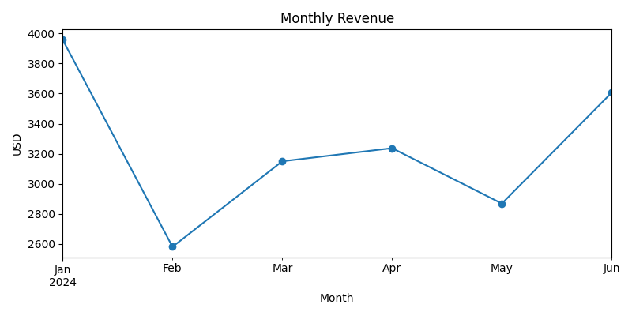
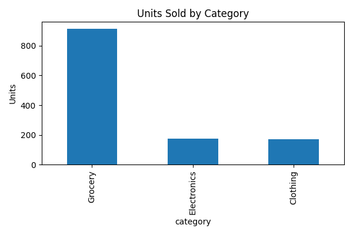
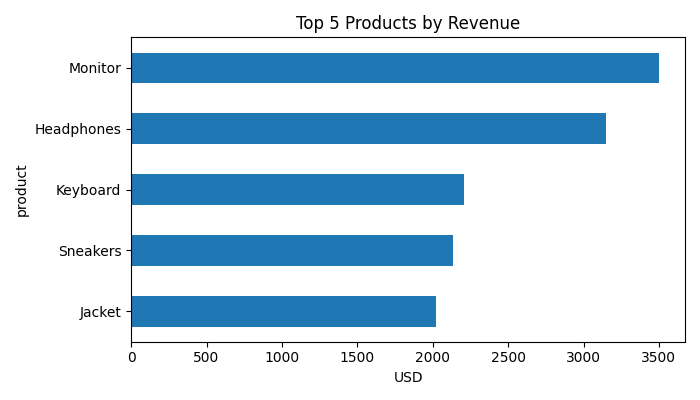

# sales-dashboard-python

## Dashboards  

### Monthly Revenue Trend  


### Units Sold by Category  


### Top Products by Revenue  


**Tech:** Python, Pandas, Matplotlib

## Run
```bash
python -m venv .venv
# macOS/Linux:
source .venv/bin/activate
# Windows (PowerShell):
# .venv\Scripts\Activate.ps1

pip install -r requirements.txt
python sales_dashboard.py
